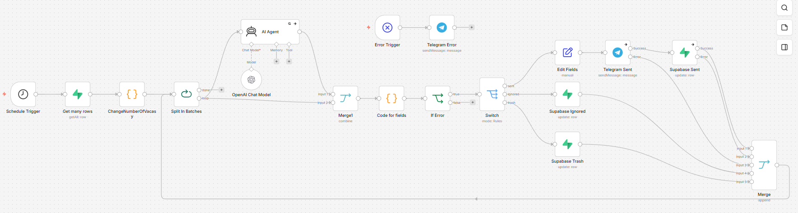

# JobFlow: Интеллектуальный парсер и агент-аналитик вакансий

Система автоматизированного сбора, фильтрации и анализа вакансий. Проект решает проблему информационного шума, используя LLM-агентов для точечного поиска релевантных проектных задач и автоматической очистки базы от «мусора».

## Архитектура системы
Система состоит из двух ключевых компонентов:
1. **Парсер (Python/Telethon)**: Асинхронно мониторит Telegram-каналы, собирает данные о вакансиях и сохраняет их в базу данных Supabase. Поиск и сбор последних сообщений осуществляются интеллектуально — с обязательным учётом идентификатора последнего проверенного сообщения (`last_message_id`), что исключает дублирование записей и снижает нагрузку на систему.
2. **Конвейер обработки (n8n)**: Автоматизированный workflow, который анализирует вакансии с помощью AI-агента (GPT-4o), распределяет их через Switch-ноду по статусам (`sent`, `ignored`, `trash`) и формирует персонализированные отклики. Также в конвейер интегрирован `Error Trigger` для оперативного оповещения о критических сбоях в Telegram.

## Как запустить автоматизацию (n8n)
Вы можете импортировать готовый workflow в ваш экземпляр n8n:
1. Скачайте файл [jobflow_workflow.json](n8n/jobflow_workflow.json).
2. В интерфейсе n8n выберите "Import from file".
3. Настройте credentials для Supabase, OpenAI и Telegram согласно вашим данным.

<b>Cхема workflow (нажмите, чтобы развернуть)</b>

 

## Настройка базы данных Supabase
Для работы системы необходимо создать две таблицы. Скопируйте и выполните следующий SQL-код в SQL Editor вашего проекта:

~~~sql
CREATE TABLE vacancies (
    id bigint GENERATED BY DEFAULT AS IDENTITY PRIMARY KEY,
    title text NOT NULL,
    url text NOT NULL UNIQUE,
    description text,
    status text DEFAULT 'new', -- Возможные статусы: new, sent, ignored, trash
    reason text,               -- Детальное обоснование категории от AI-агента
    created_at timestamp with time zone DEFAULT timezone('utc'::text, now()) NOT NULL
);

CREATE TABLE active_channels (
    id bigint GENERATED BY DEFAULT AS IDENTITY PRIMARY KEY,
    username text NOT NULL UNIQUE,
    last_message_id bigint DEFAULT 0,
    is_active boolean DEFAULT true,
    created_at timestamp with time zone DEFAULT timezone('utc'::text, now()) NOT NULL
);

INSERT INTO active_channels (username) VALUES ('sova_freelance');
~~~

## Установка и запуск

~~~env
# 1. Подготовка переменных окружения (.env):
# Создайте файл .env в корне проекта и добавьте в него ваши данные:
API_ID=ваш_api_id
API_HASH=ваш_api_hash
SUPABASE_URL=ваш_url_проекта
SUPABASE_KEY=ваш_ключ_api

# 2. Установка зависимостей и запуск скрапера:
# Для корректной работы импортов запускайте проект как модуль из корневой директории:
pip install -r requirements.txt
python -m src.scraper
~~~

## Технологический стек
- **Backend**: Python, Telethon, Supabase.
- **Automation**: n8n (с использованием Switch-нод и Error Trigger).
- **AI/LLM**: OpenAI GPT-4o, LangChain.
- **Deployment**: Render.

## Портфолио
Больше проектов: [github.com/Aygren](https://github.com/Aygren)